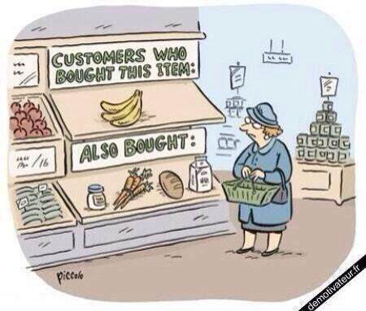
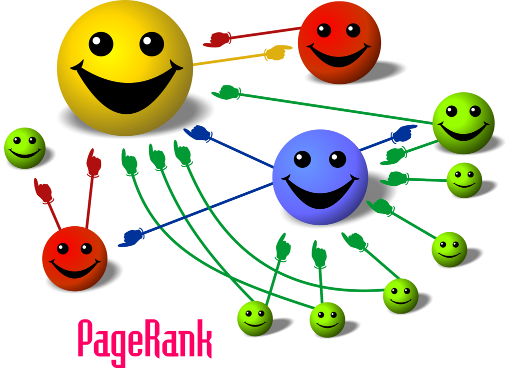

# Introduction

## A provoking quote

> “A squirrel dying in front of your house may be more relevant to your interests right now than people dying in Africa.” – Mark Zuckerberg

## Personalizing filters and information

Thesis: personalization filter may be dangerous for democracy, if they are applied without people knowing

* democracy doesn't work without a good flow of information
* filters alter our perception of the world
* the information given to the voters should be not filtered according to what they like
* this was the first USA election in which the role of filtering social media was explicitly questioned
* personalization filter are good for some specific domains, though

## The dangers of personalization
*The Filter Bubble* by Eli Pariser mentions several risks of personalizing filters:

* Data collection and privacy concerns
* Democracy
* Information
* Freedom
* Creativity
* Censorship
* Serendipity
* ...we will focus on the threats that personalization filters pose to the access to information.

## Recommender systems
**Recommender systems** are information filtering systems that seek to predict the "rating" or "preference" that a user would give to an item *(Wikipedia)*

Examples:

* Netflix
* Google Search
* Facebook newsfeed
* Amazon
* Online dating sites

## ...Amazon in real life
{width=80%}

## Facebook is too friendly

I'm a liberal with some conservative friends.

* Why conservatives posts disappeared from my Newsfeed?
* Online communities are becoming more and more homogeneous
* Even if you are friend of someone, you may not see his/her updates because of the bubble

## Google: the classical relevance model
**Relevance** according to **PageRank**: a page is important if it's linked by important pages.

* Each incoming link, weighted by the relevance of its source, contributes to the relevance of the page
* **Universal ranking**: the PageRank algorithm is independent from the users who's querying

{width=60%}

## Our own Google

**There is no "standard Google" anymore!**

* 2009: Google extended personalized search also to logged off users
* Google uses 57 *signals* to personalize the search results
* Example: search for "Egypt"
    * protests for one
    * travel, vacation for another
* More and more difficult to find what we don't know we want

## The Filter Bubble

**Give a precise, short definition of the Filter Bubble**

# Concerns about the Filter Bubble

## Freedom and autonomy

> “To be free, you have to be able not only to do what you want, but to know what's possible to do." (Eli Pariser)

* Loop: we read only what we're interested in because of the recommendation
* We get trapped in a local maximum of preference, and it's difficult to escape
* Self-fulfilling prophecy
* Inside the filter bubble we're unable to reach new ideas and point of view
* *Serendipity* is harmed

## Information

* Friendly world syndrome: some of the most important problem don't reach our view at all
* We can miss major news and events
* In the filter bubble, the public sphere is less relevant
* Filters block important, unpleasant things that we *should* care about
* Some topics will always be *not likable*, though they are important.
    * War, homelessness, poverty, ...
* Algorithms don't have embedded ethics
* Relevance shouldn't be the only metric

## Democracy

> “personalization filters serve up a kind of invisible autopropaganda, indoctrinating us with our own ideas, amplifying our desire for things that are familiar and leaving us oblivious to the dangers lurking in the dark territory of the unknown.” (Eli Pariser)

* Contrasting views and provoking ideas will likely not be shown by filters
* Think about the Facebook feed example

## Comparison with traditional media
* Pull (active) vs. push (passive) news fetching
* NYT journos aren't allowed to see how many clicks their articles got
* Curation by human gatekeepers vs. disintermediation
* Media that prioritize importance over relevance are useful

## Filter bubble is always on
* You don't decide (nor see) what's in it
* You don't see, from the inside, what's out.

## Aspirational self and actual self
* Netflix queue example
* Personalization privileges the actual self
* Balanced information diet vs. information junk food
* Consuming information "near" to us is easy and pleasurable
* Consuming challenging info is difficult

# Solutions and remedies

## Moralizing filters

* The Internet is showing off what we want to see, but not **what we need to see**
* What if one day Google could urge us to stop obsessing over Lady Gaga’s videos and instead pay attention to Darfur?
* Should someone decide what we need to see?
* This is **paternalism**.

## Making the algorithms transparent

* Even if they are public, we may not understand them
* ...

## On-off button

> “Google or Facebook could place a slider bar running from “only stuff I like” to “stuff other people like that I’ll probably hate” at the top of search results and the News Feed”

## Government oversight

Slide

# Counter-objections

## "But they are useful!"

* Filters help eliminating the noise in the information society
* ...

## "We can just shut them off"

Not so simple.

## They are just a natural evolution of technology

Maybe. Or maybe not!

# Conclusion

## Are personalizing filter harmful?

Yes, they can be harmful if the people are using them without knowing

* Though, they are a really good technology for many specific application
* Should not be used extensively for shaping public opinion

# Bibliography

## Bibliography

* Eli Pariser, "The Filter Bubble", 2011
* Cass Sunstein, "Republic.com" (?)
* Evgeny Morozov, [*Your Own Facts*](http://www.nytimes.com/2011/06/12/books/review/book-review-the-filter-bubble-by-eli-pariser.html), NY Times, 2011
* [Eli Pariser's TED Talk](https://www.ted.com/talks/eli_pariser_beware_online_filter_bubbles)
