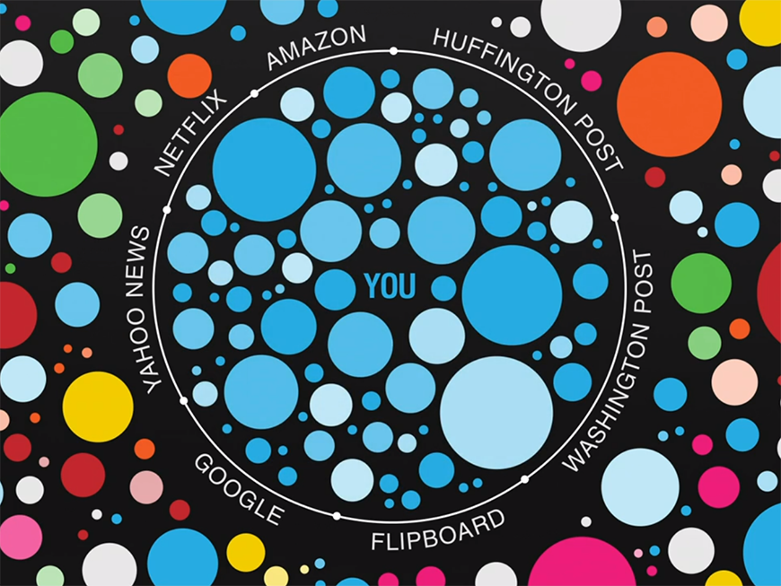

# Introduction

## A provoking quote

> “A squirrel dying in front of your house may be more relevant to your interests right now than people dying in Africa.”

> – Mark Zuckerberg

## What is the filter bubble?

## Definitions

### Personalized search

> **Personalized search** refers to search experiences that are tailored specifically to an individual's interests by incorporating information about the individual beyond specific query provided. (Wikipedia)

### Filter bubble

> A **filter bubble** is a result of a personalized search in which a website algorithm selectively guesses what information a user would like to see based on information about the user (such as location, past click behavior and search history). (Wikipedia)

### Information pluralism

TODO

## Personalizing filters and information

In this presentation, I will show that:

> **Personalized search filters may be harmful for the plurality of information**, and citizens and readers are not fully aware of those.

* filters alter our perception of the world
* information given to citizens should be not filtered according to what they like
* even if they seem fair, **these algorithms are not neutral**

# Concerns about the Filter Bubble

## The dangers of personalization
The book *The Filter Bubble* by Eli Pariser [@pariser2011] mentions several risks about personalizing filters:

* Data collection and privacy
* Democracy
* **Information** (I will focus on this)
* Freedom
* Creativity
* Censorship
* Serendipity

## Information

* **Friendly world syndrome**: some of the most important problem don't reach our view at all
* We can miss major news and events
    * This was not possible with e.g. traditional newspapers
* In the filter bubble, the **public sphere** is less relevant
* Filters block **important, unpleasant things** that we *should* care about
    * Some topics will always be *not likable*: war, homelessness, poverty...
* *Relevance* is the only metric, and *importance* matters less
* The **choice** about what to read is no more in readers' hands
    * Contents inside your personal bubble aren't shown
* Often there's no way to disable the personalization

# Case study: Facebook (and Google)

## Facebook is too friendly!

Suppose that you are a Facebook user and you identify as a **liberal**.
You have both liberals and conservatives friends.

* In the News Feed, you get more posts which reflect what you like
* You may not see conservatives' stories at all, if you interact less with your conservative friends
* **Cross-cutting stories** (those different from our viewpoint) are less likely to reach us
    * How big is this phenomenon?

## Facebook study (1)

Facebook published a study [@bakshy2015] on *Science* about how likely are users to **view and interact with *cross-cutting content***.

{width=70%}

1. *Potential from network*: shared by friends
2. *Exposed*: effectively shown in users' News Feeds
3. *Selected*: clicked by the user

## Facebook study (2)

{height=100%}

## Facebook study (3)

Conclusions:

* The **friendship network** is the most important factor limiting the mix of content encountered in social media.
    * if I have only friends of the same political affiliation, the filter bubble is obvious
* **Individual choice** influences the exposure to cross-cutting content more than the News Feed filtering.
* The effect of **News Feed ranking** is limited:
    * -5% for liberals
    * -8% for conservatives

\alert{Thus, Facebook says, any "filter bubble" is not due to the News Feed selection algorithm.}

## Facebook study: criticism

### Limitations of the study

* Underlying (false) assumption: the building of the **friendship network** is independent from Facebook's algorithms
    * Friends are only partly from "offline" connections
    * Facebook suggests both pages to like and new friends
* What about **sponsored content**?

### Methodological issues

* **Sample** of the study: people which declare their political affiliation.
    * may not be representative of the entire Facebook community
* Independent researchers can't access Facebook data and analyze it.

## The position is everything

The **position** of a story in the News Feed is very important

* the ranking algorithm may be used to promote some stories and not others
* money can buy rankings!
* even if the algorithm is "fair" *now*, what about the future?

{width=100%}

## Google: the classical relevance model
**Relevance** according to **PageRank**: a page is important if it's linked by important pages.

* Each incoming link, weighted by the relevance of its source, contributes to the relevance of the page
* **Universal ranking**: the PageRank algorithm is independent from the user who's querying

{width=60%}

## Google: relevance is now personal

**There is no "standard Google" anymore!**

* 2009: Google extended personalized search also to logged off users
* Google uses 57 *signals* to personalize the search results
* Example: a search for "Egypt" can yield different results:
    1. Protests and political issues
    2. Travel and vacation information
* More and more difficult to find *what we don't know we want*.

Researchers found out that in Google searches **11.7% of results show differences** due to personalization. [@hannak2013]

# Proposed remedies and counter-objections

## Moralizing filters

Problem: the Internet is showing off what we *want* to see, but not what we *need* to see.

* What if one day Google could urge us to stop obsessing over Lady Gaga's videos and instead pay attention to Darfur?
* Would it be a good idea to make multinational companies **moralizing agents**?
    * Monopoly of editorial power
    * **Paternalism**
* Algorithms cannot compute "what should be seen" [@morozov2011]

We need media that prioritizes **importance** over relevance, but:

* this requires human intervention and choice
* using an algorithm is still a non-neutral choice!

## More control by the people

### Make the algorithms transparent

* Knowing at least **which personal data** is used to make the recommendation may prove useful
* The inner working of complex neural networks and machine learning agents is not explorable
* Even if published, we may not understand those algorithms
* They are often **trade secrets**

### Government oversight

Problem: the personalizing filters are not regulated in a **democratic** way.
Governments could banish personalization or control it in some form.

* Information should be independent by the Government
* The convergence of power of multinational companies and governments is dangerous

## Turn off the personalization!

* What if we could **turn off the personalization**?
* Personalization is the key feature of most services
    * Facebook without personalization would be... Twitter?
* Without personalization **ads would be less relevant** and profitable: no economic incentive to do so
* Users should at least know **whether** personalization is enabled or not.

# Conclusion

## Are personalizing filter harmful?

Yes, they can be harmful if the people are using them without knowing

* Though, they are a really good technology for many specific application
* Should not be used extensively for shaping public opinion
